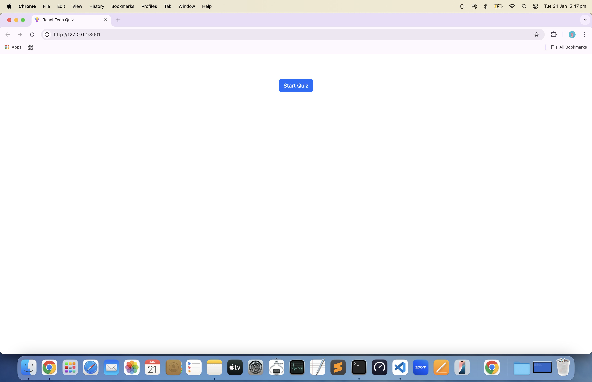
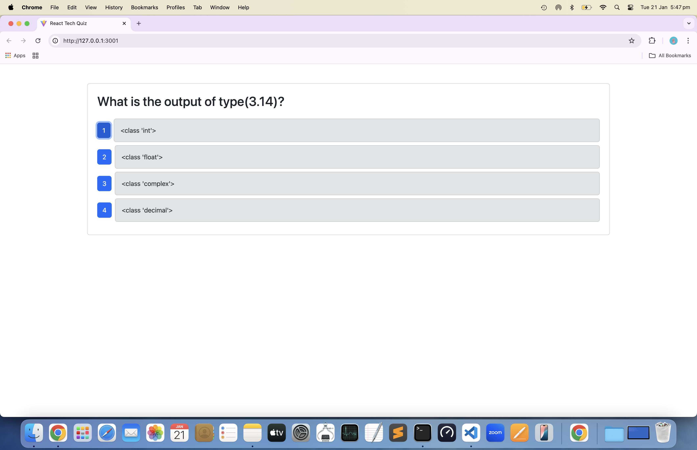
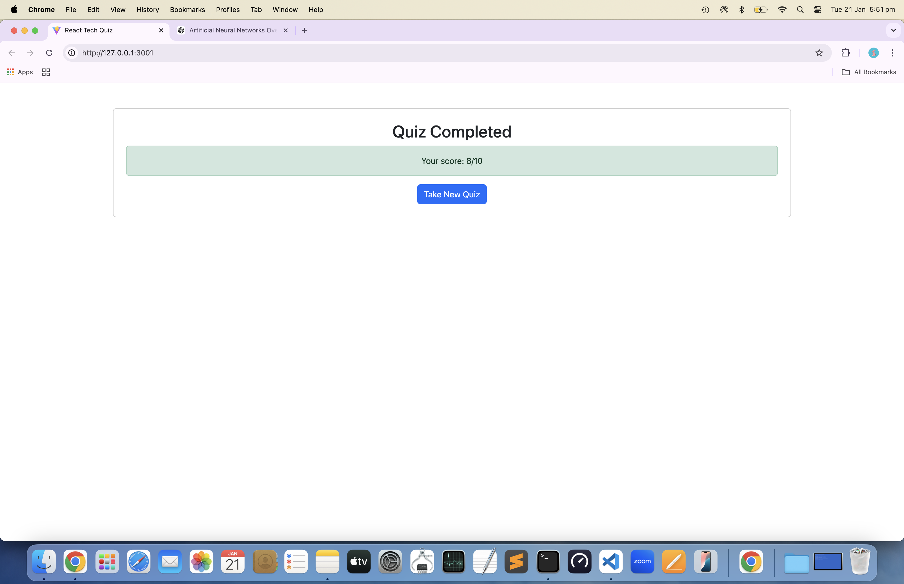
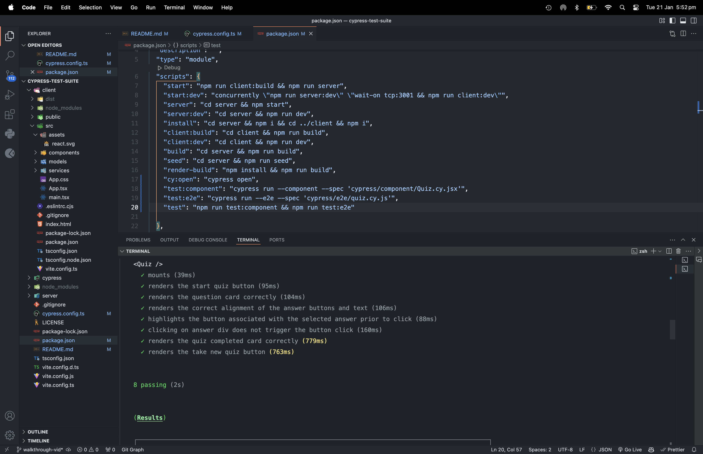

# cypress-test-suite

Apply component and end-to-end testing with Cypress to an existing quiz app

## Table of Contents

- [Description](#description)
- [Installation](#installation)
- [Usage](#usage)
- [License](#license)
- [Contributing Guidelines](#contributing-guidelines)
- [Testing](#testing)
- [Authors and Acknowledgements](#authors-and-acknowledgements)

## Description

Refactor an existing google books RESTful API into a grahql API built with apollo server.

## Installation

To get started with this project, implement the following steps:

1. Clone the repo:

```zsh
git clone

```

2. In 'root' directory, install dependencies:

```zsh
npm install @types/react @vitejs/plugin-react concurrently cypress nodemon react react-dom react-router-dom typescript vitest wait-on --save-dev
```

3. In 'server' folder, install dependencies and add nodemonConfig:

```zsh
npm install express mongoose
npm install @types/express @types/node dotenv typescript --save-dev

"nodemonConfig": {
  "watch": [
    "src"
  ],
  "ext": "ts,json,js",
  "excec": "npx tsc && node dist/server.js"}
```

4. In 'client' folder, install dependencies:

```zsh
npm install bootstrap react react-dom react-router-dom

npm install @types/react @types/react-dom @typescript-eslint/eslint-plugin @typescript-eslint/parser @vitejs/plugin-react eslint eslint-plugin-react-hooks eslint-plugin-react-refresh typescript vite --save-dev
```

5. Configure TypeScript:

- root/tsconfig.json conatins the base configuration with references:

"references": [
{
"path": "./server"
},
{
"path": "./client"
},
{
"path": "./cypress"
}]

- server/tsconfig.json extends the root and adds settings specific to the server-side including typeRoots:

"typeRoots": ["./node_modules/@types", "./src/types"]

- client/tsconfig.json contains client specific configuration and refernces:

"jsx": "react-jsx"
"references": [{ "path": "./tsconfig.node.json" }]

6. In 'root' directory, create .gitignore file and add:

.env
node_modules

7. In 'server' directory, create .env file and add:

```javascript
MONGODB_URI=mongodb://127.0.0.1:27017/techquiz

```
8. Check app is successfully connecting to mongoDB:

```zsh
npm run start
```
9. Seed database:

```zsh
npm run seed
```

10. In 'root' directory, open cypress:

```zsh
npx cypress open
```

11. In 'root' package.json, add cypress commands to scripts:

{
"scripts": {
"cy:open": "cypress open"
}
}

12. To invoke testing run the following command in 'server':

```zsh
npm run test
```

13. In Cypress, navigate to component testing and confirm front-end framework and bundler:

front-end framework: React.js
bundler: Vite

14. Confirm cypress configuration files added to project:

'cypress.config.ts'
'cypress/support/component.ts'
'cypress/support/commands.ts'
'cypress/support/component-index.html'
'cypress/fixtures/example.json'

15. Start component testing in Chrome browser:

16. Start end-to-end testing in Chrome browser:

17. To build the application run the following command in 'root':

```zsh
npm run render-build
```

## Usage

Link to walkthrough-video:

[walkthrough-video]()

Screenshots of app demonstrating functionality:

### screenshot-1



### screenshot-2



### screenshot-3



### screenshot-4



## License

[](https://opensource.org/licenses/MIT)

## Contributing Guidelines

Create a new branch for the commit and start a pull request.

## Testing

To ensure the app works correctly, the following E2E test is implemented:

Install cypress:

```zsh
npm install cypress --save-dev
npx cypress open
```

## Authors and Acknowledgements

[email] (ginadrcoder@gmail.com)

## Questions

For enquiries, please contact me at:

[email] (ginadrcoder@gmail.com)

[github] (https://github.com/gina-t)
