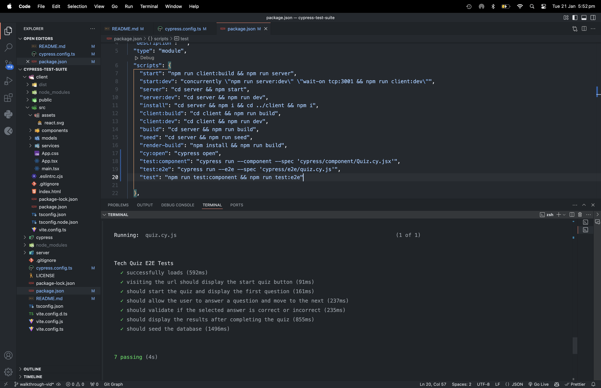

# cypress-test-suite

## Table of Contents

- [Description](#description)
- [Installation](#installation)
- [Usage](#usage)
- [License](#license)
- [Contributing Guidelines](#contributing-guidelines)
- [Testing](#testing)
- [Authors and Acknowledgements](#authors-and-acknowledgements)

## Description

Apply component and end-to-end testing with Cypress to an existing quiz app


## Installation

To get started with this project, implement the following steps:

1. Clone the repo:

```zsh
git clone git@github.com:gina-t/cypress-test-suite.git

```

2. In `root` directory, install dependencies:

```zsh
npm install @types/react @vitejs/plugin-react concurrently cypress nodemon react react-dom react-router-dom typescript vitest wait-on --save-dev
```

3. In `server` directory, install dependencies:

```zsh
npm install express mongoose
npm install @types/express @types/node dotenv typescript --save-dev
```

4. Add the following nodemonConfig to package.json:

```json
{
"nodemonConfig": {
  "watch": [
    "src"
  ],
  "ext": "ts,json,js",
  "excec": "npx tsc && node dist/server.js"
  }
}
```

5. In `client` directory, install dependencies:

```zsh
npm install bootstrap react react-dom react-router-dom

npm install @types/react @types/react-dom @typescript-eslint/eslint-plugin @typescript-eslint/parser @vitejs/plugin-react eslint eslint-plugin-react-hooks eslint-plugin-react-refresh typescript vite --save-dev
```

6. Configure TypeScript:

- `root/tsconfig.json` contains the base configuration with references:

```json
{
"references": [
{"path": "./server"},
{"path": "./client"},
{"path": "./cypress"}
]
}
```

- `server/tsconfig.json` extends the root and adds settings specific to the server-side including typeRoots:

```json
{
"typeRoots": ["./node_modules/@types", "./src/types"]
}
```

- `client/tsconfig.json` contains client specific configuration and references:

```json
{
"jsx": "react-jsx"
"references": [{ "path": "./tsconfig.node.json" }]
}
```

7. In `root` directory, create `.gitignore` file and add:

```plaintext
.env
node_modules
```

8. In `server` directory, create `.env file` and add:

```plaintext
MONGODB_URI=mongodb://127.0.0.1:27017/techquiz
```

9. Check app is successfully connecting to mongoDB:

```zsh
npm run start
```
10. Seed the database:

```zsh
npm run seed
```

11. In `root` directory, open cypress:

```zsh
npx cypress open
```

12. In `root` package.json, add cypress commands to scripts:

```json
{
  "scripts": {
    "cy:open": "cypress open"
  } 
}
```

13. In `root` directory, start your local development server:

```zsh
npm run start:dev
```

14. In Cypress, navigate to component testing and confirm front-end framework and bundler:

front-end framework: React.js
bundler: Vite

15. Confirm cypress configuration files added to project:

'cypress.config.ts'
'cypress/support/component.ts'
'cypress/support/commands.ts'
'cypress/support/component-index.html'
'cypress/fixtures/example.json'

16. In cypress.config.ts, add baseUrl and specPattern:

```typescript
export default defineConfig({
  component: {
    devServer: {
      framework: "react",
      bundler: "vite",
    },
    specPattern: "cypress/component/**/*.cy.{js,jsx,ts,tsx}",
  },

  e2e: {
    baseUrl: "http://127.0.0.1:3001/",
    specPattern: "cypress/e2e/**/*.cy.{js,jsx,ts,tsx}",
    setupNodeEvents(on, config) {
      // implement node event listeners here
    },
  },
});
```

17. Start component testing in Chrome browser.

18. Start end-to-end testing in Chrome browser.

19. Add scripts to `root` package.json to run cypress component and e2e tests sequentially:

```json
{
  "scripts": {
    "test:component": "cypress run --component --spec 'cypress/component/Quiz.cy.jsx'",
    "test:e2e": "cypress run --e2e --spec 'cypress/e2e/quiz.cy.js'",
    "test": "npm run test:component && npm run test:e2e"
  }
}
```

20. Invoke cypress tests in command line:

```zsh
npm run test
```

## Usage

Link to walkthrough-video:

[walkthrough-video]()

Screenshots of app demonstrating functionality:

### screenshot-1


### screenshot-2


### screenshot-3


### screenshot-4


### screenshot-5




## License

[](https://opensource.org/licenses/MIT)

## Contributing Guidelines

Create a new branch for the commit and start a pull request.


## Authors and Acknowledgements

[email] (ginadrcoder@gmail.com)

## Questions

For enquiries, please contact me at:

[email] (ginadrcoder@gmail.com)

[github] (https://github.com/gina-t)
